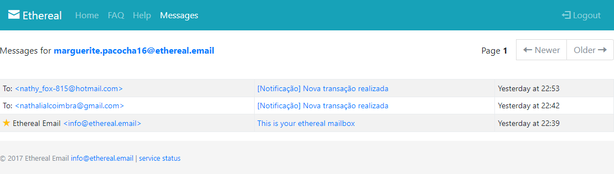
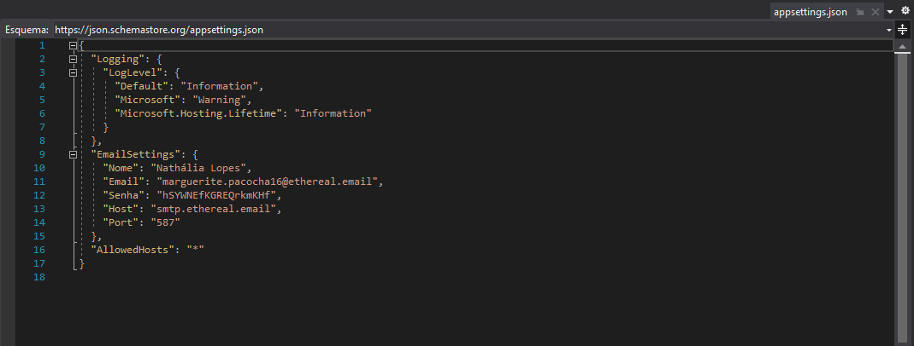
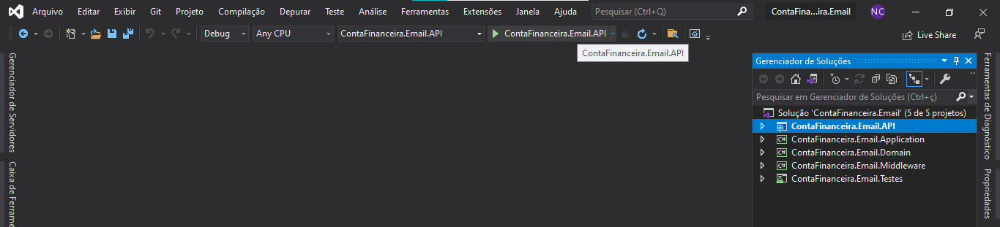
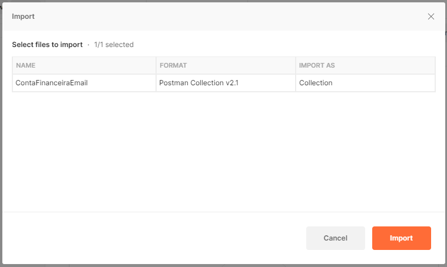
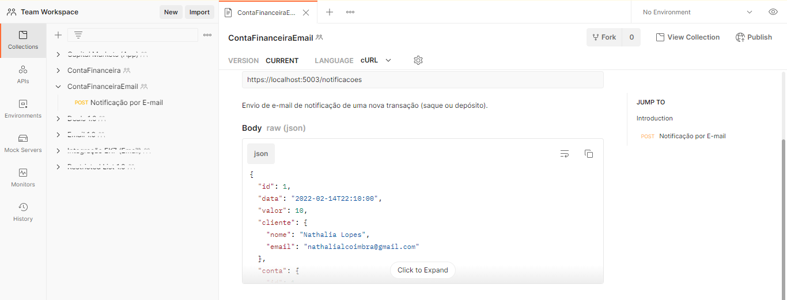

# ContaFinanceira.Email
Envio de e-mail de notificação de transações da aplicação ContaFinanceira


## Estrutura de Pastas da Solução
| **Pasta** | **Descrição** |
| :---: | :---: |
| **ContaFinanceira.Email.API** | Contém os controllers da aplicação e configurações da aplicação (injeções de dependência, Cors, etc) |
| **ContaFinanceira.Email.Application** | Contém todos os serviços e validações do projeto, utilizados pelos controllers |
| **ContaFinanceira.Email.Domain** | Contém todos os requests, responses, view models e interfaces do projeto |
| **ContaFinanceira.Email.Middleware** | Contém um interceptador de logs para inclusão de correlationId |
| **ContaFinanceira.Email.Tests** | Contém todos os testes unitários dos controladores, services e validadores do projeto |


## Email
Envio de e-mail utilizando um falso SMTP chamado Ethereal


Para utilizar a aplicação, siga os seguintes passos:

1. Clone o repositório do git ou faça download do projeto
2. Abra o arquivo *ContasFinanceiras.Email.API > appsettings.json* e altere o EmailSettings com suas informações


## Debug com Visual Studio
3. Abra a solução no Visual Studio 2019 ou posterior
4. Certifique-se que o projeto de inicialização é o *ContasFinanceiras.Email.API* (destacado em negrito). Se estiver, pule para o passo 6
5. Clique com o botão direito do mouse sobre o projeto *ContasFinanceiras.Email.API* e selecione a opção *Definir como Projeto de Inicialização*
6. No botão de iniciar, selecione o projeto *ContasFinanceiras.Email.API*


7. Pronto! O navegador deve abrir com o [Swagger para teste](#swagger)
8. Siga o [passo a passo para testar a aplicação](#como-testar-a-aplicação)

## Docker
3. Caso não tenha o Docker instalado, baixe [**aqui**](https://hub.docker.com/editions/community/docker-ce-desktop-windows) e inicie-o
4. Abra o prompt de comando e navegue até a pasta com o projeto *ContasFinanceiras.Email.API*
5. Digite os comandos abaixo:

```
docker build -t conta-financeira-email-app .
docker run -d -p 5003:80 --name contafinanceiraemail conta-financeira-email-app 
```

Também é possível executá-la no Docker pelo Visual Studio. No passo 6 de **debug com Visual Studio**(#debug-com-visual-studio) selecione a opção *Docker* para execução.


# Como testar a aplicação
A aplicação pode ser testada via Postman e Swagger. Veja abaixo um passo a passo sobre como fazer isso:

## Postman
1. Baixe a collection <a id="raw-url" href="https://github.com/Nathy815/ContaFinanceira.Email/tree/master/medias/ContaFinanceiraEmail.postman_collection.json">aqui</a>
2. Importe a collection no Postman (versão 2.1)


3. Após importada, a coleção aparecerá no menu da esquerda. Basta selecionar a chamada que deseja e clicar em **Send**


**IMPORTANTE!** 
As rotas estão configuradas para [**Debug com Visual Studio**](#debug-com-visual-studio). 
Caso opte por outra forma de uso da aplicação, será necessário substituir o servidor https://localhost:5003/ da rota pelo o que você está utilizando.


## Swagger
1. Seguindo as orientações de [**debug com Visual Studio**](#debug-com-visual-studio), o Swagger abrirá automaticamente. No entanto, caso tenha optado por outra forma de utilização, basta adicionar /swagger na rota em que a aplicação está rodando
2. Uma vez aberto, basta expandir a rota que deseja executar. Em casos de rotas sem parâmetros, clique em Execute. Nas rotas com parâmetros, é necessário preencher o body antes de executar
